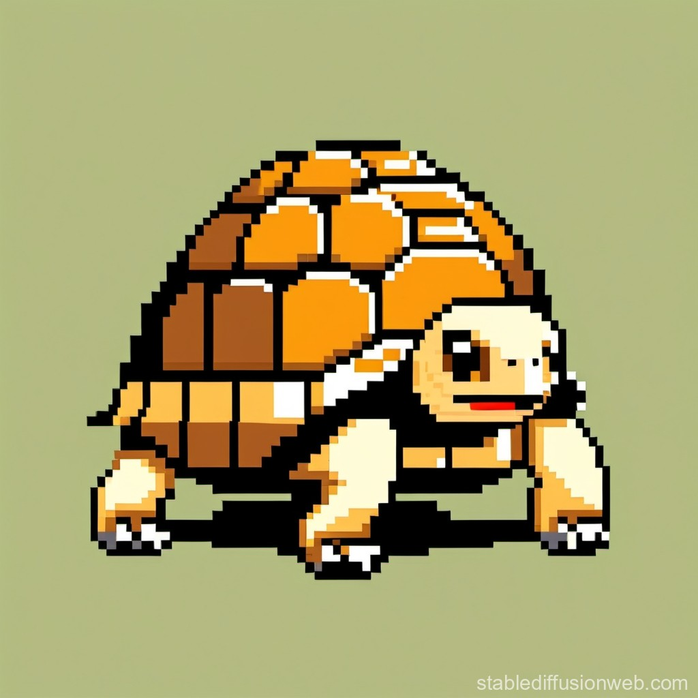

# Tortoys
<div align="center">
    
    <h1>Tortoys</h1>
    <p>Its LOGO but BETTER.... A programming language over Turtle Graphics </p>

    [](https://choosealicense.com/licenses/mit/)
</div>


 - A programming language made for kids to learn about programming and some turtle programming
 - Will help them to create beautiful patterns and arts
 - They can also learn about python 


##  Author

-  [@rudransh61](https://www.github.com/rudransh61)


## How to install it

To install it first you need to clone this repository using `git clone` command,

Then make sure you had already installed Python `3.10.9` or above or any other python version which works .

Then install all the requirements by running 
```bash 
$ pip install requirements.txt 
# pip must be installed first also with python
```

Then you can use the following command to run the example project in file  `example_code.ty` with Tortoys interpreter
```bash
$ py ./tortoys.py --f ./example_code.ty
# use / or \ in file according to your OS.
```

Then you can see the example running...

___

# Documentation

## Introduction

Tortoys is a simple programming language designed for turtle graphics. It allows users to control a turtle on the screen using a set of commands.

## Commands

### RIGHT

The `RIGHT` command rotates the turtle to the right by a specified angle.

```tortoys
RIGHT 90
```

### LEFT

The `LEFT` command rotates the turtle to the left by a specified angle.

```tortoys
LEFT 45
```

### MOVE

The `MOVE` command moves the turtle forward by a specified distance.

```tortoys
MOVE 100
```

### COLOR

The `COLOR` command sets the color of the turtle.

```tortoys
COLOR "blue"
```

### MOVETO

The `MOVETO` command moves the turtle to a specified position.

```tortoys
MOVETO 50 50
```

### SPEED

The `SPEED` command sets the speed of the turtle.

```tortoys
SPEED 2
```

### TITLE

The `TITLE` command sets the title of the turtle screen.

```tortoys
TITLE "My Turtle"
```

### CLEAR

The `CLEAR` command clears the turtle screen.

```tortoys
CLEAR
```

### SETX

The `SETX` command sets the x-coordinate of the turtle.

```tortoys
SETX 50
```

### SETY

The `SETY` command sets the y-coordinate of the turtle.

```tortoys
SETY 30
```

### PRINT

The `PRINT` command prints a message to the console.

```tortoys
PRINT "Hello, Tortoys!"
```

### SET

The `SET` command is used to set variables.

```tortoys
SET A 10
SET B A+5
```

### CLOSE

The `CLOSE` command closes the turtle screen.

```tortoys
CLOSE
```

### DONE

The `DONE` command completes the turtle graphics program.

```tortoys
DONE
```

## Comments

Comments in Tortoys start with a `#` symbol and are ignored by the interpreter.

```tortoys
# This is a comment
RIGHT 90  # This is also a comment
```

## Variables

Variables in Tortoys are used to store values. They are defined using the `SET` command.

```tortoys
SET A 10
SET B A+5
```

## Example Program

Here's a simple example program that draws a square:

```tortoys
# Example: Draw a Square
MOVE 100
RIGHT 90
MOVE 100
RIGHT 90
MOVE 100
RIGHT 90
MOVE 100
```

This program moves the turtle forward by 100 units, then turns right 90 degrees and repeats the process three more times, creating a square.

Feel free to customize and expand upon these examples to create your own Turtle graphics programs using Tortoys!

___


##  Contributing

  

Contributions are always welcome!

We want developers who are the future of next generation to transform this small project.

  

See `CONTRIBUTING.md` for ways to get started.